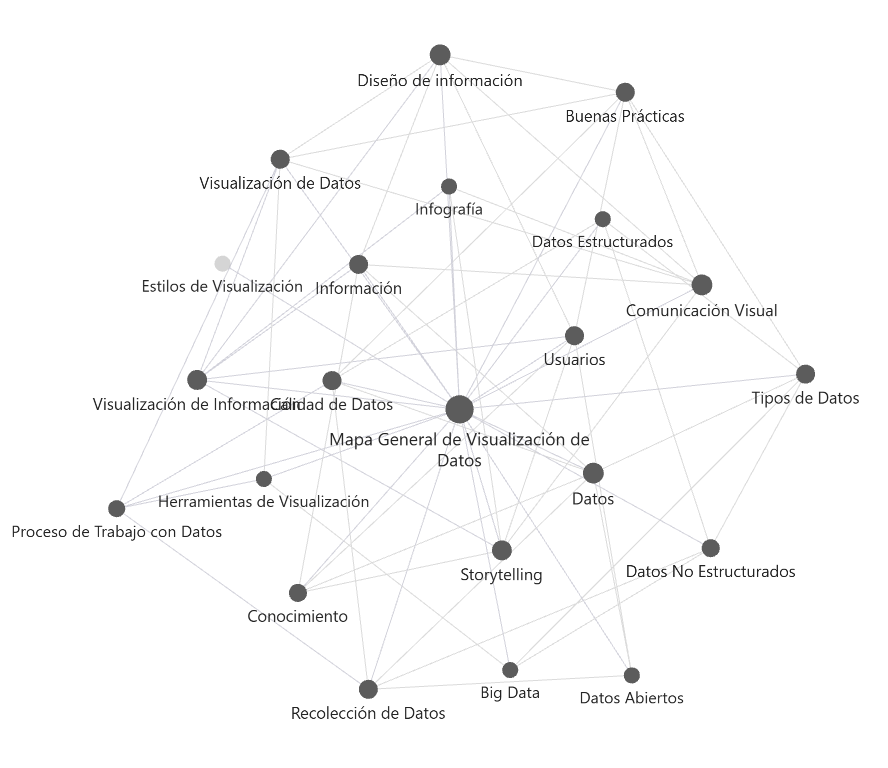

# Evaluación Sumativa Unidad 1: Conceptos Fundamentales de Visualización de Datos

##  Información General
- **Estudiante:** Bryan Carrasco
- **Asignatura:** Visualización de Datos
- **Carrera:** Ingeniería Informática
- **Fecha:** 28 de Septiembre de 2026
- **Docente:** Javier Ingacio Miles Avello

---

##  Descripción del Proyecto
Este repositorio contiene la construcción de una base de conocimiento interconectada en **Obsidian** y versionada en **GitHub**, desarrollada a partir de la lectura del libro *Visualización de la información: De los datos al conocimiento* de Ignasi Alcalde Perea. 

El proyecto integra:
1. Una Vault estructurada en Obsidian con un MOC principal y 20+ notas conceptuales interconectadas.
2. Un Mapa Conceptual Integrador elaborado en Canvas.
3. Un Análisis Crítico de tres visualizaciones reales de diferentes contextos.
4. Un Ensayo Profesional sobre la transformación de datos en conocimiento para la toma de decisiones.
5. Una Reflexión Técnica sobre el impacto de Obsidian y GitHub en la Ciencia de Datos.

## Visual Graph

## Aprendizajes Obtenidos
1. Gestión no lineal del conocimiento: Comprender cómo Obsidian permite construir una "segunda mente" interconectada mediante WikiLinks, superando las limitaciones jerárquicas tradicionales.
2. Rigor en la visualización: Evaluar cómo la calidad de los datos, el respeto por las escalas reales y el diseño centrado en el usuario previenen la desinformación y facilitan la toma de decisiones.
3. Trazabilidad técnica: Utilizar Git y GitHub de manera progresiva para garantizar la reproducibilidad y el versionado continuo en proyectos analíticos de Ciencia de Datos.